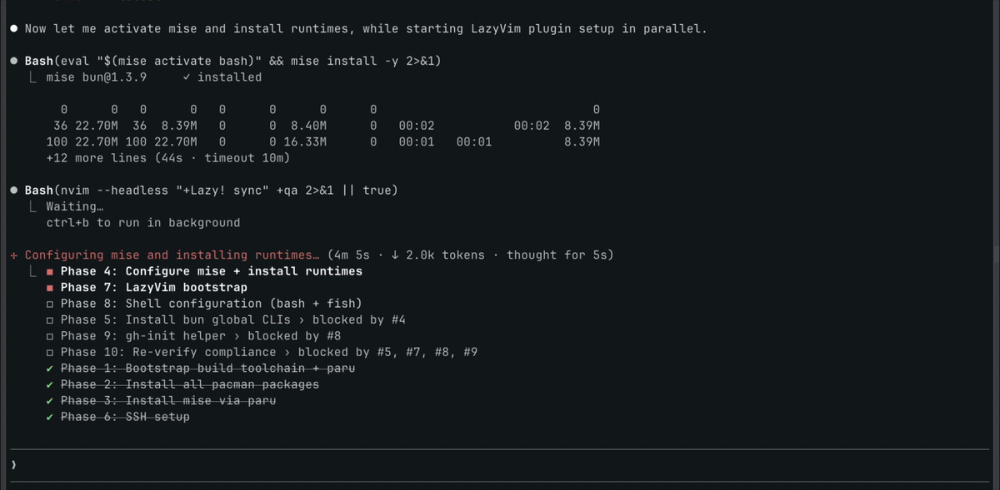

# setup-env

System setup as a product:
- Markdown + YAML contracts for machine setup intent and verification.
- Agent skills that work across tools, prewired for Codex and Claude.

## Why this exists
Most dotfiles repos are scripts and one-off shell tweaks. This repo is different:
- Define setup as a clear contract (what must be true).
- Verify compliance deterministically (what passes and fails).
- Keep instructions portable across machines and agents.

## Value
- Single source of truth for environment requirements.
- Contract-first model: human-readable docs + machine-validated structure.
- Repeatable verification via `tools/validate-contract.sh`.
- SSH clipboard sharing contract for `tmux + Neovim` via OSC52.
- Shared skill catalog under `.agent/skills` with repo-local links:
  - `.codex/skills -> ../.agent/skills`
  - `.claude/skills -> ../.agent/skills`

## Quick Start
Start here: [`quickstart.md`](quickstart.md)

## Demo

## What is in this repo
- `capabilities/`: capability contracts and rule definitions.
- `profiles/`: composed capability sets (core and optional).
- `os/`: platform-specific constraints.
- `validation/`: scenarios, checklist, and waivers.
- `schemas/`: contract schema definitions.
- `contracts/`: generated contract index and runner contract.
- `tools/`: validation and index-generation scripts.
- `nvim/`: active Neovim dotfile fragments for this setup.
- `tmux/`: active tmux dotfile fragments for this setup.
- `.agent/skills/`: reusable cross-agent skills.
- `templates/`: drop-in templates (LazyVim, shell shortcuts, tmux snippets).

## Contributing
Contribution workflow, authoring rules, and validation steps:
[`CONTRIBUTION.md`](CONTRIBUTION.md)

## Non-Goals
- Provisioning/bootstrap scripts in this repo.
- Secret values in tracked files.
